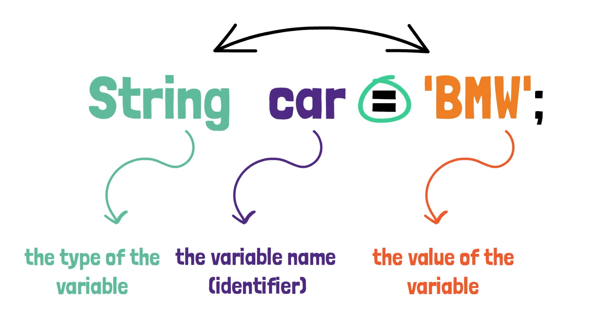
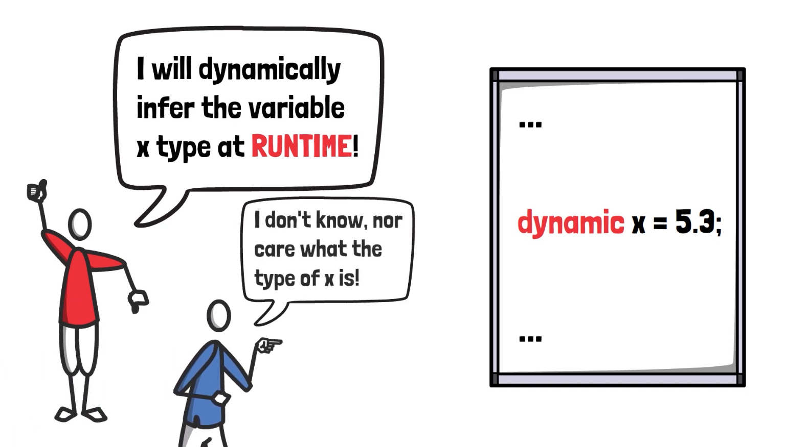
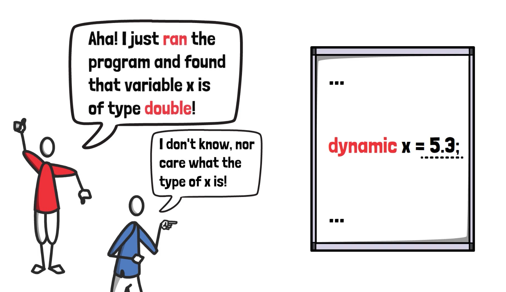
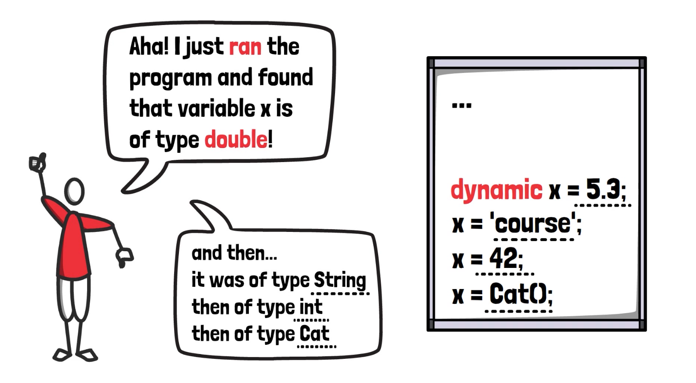
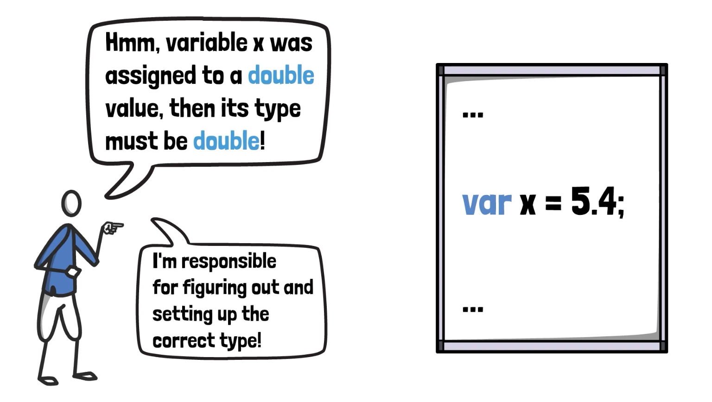
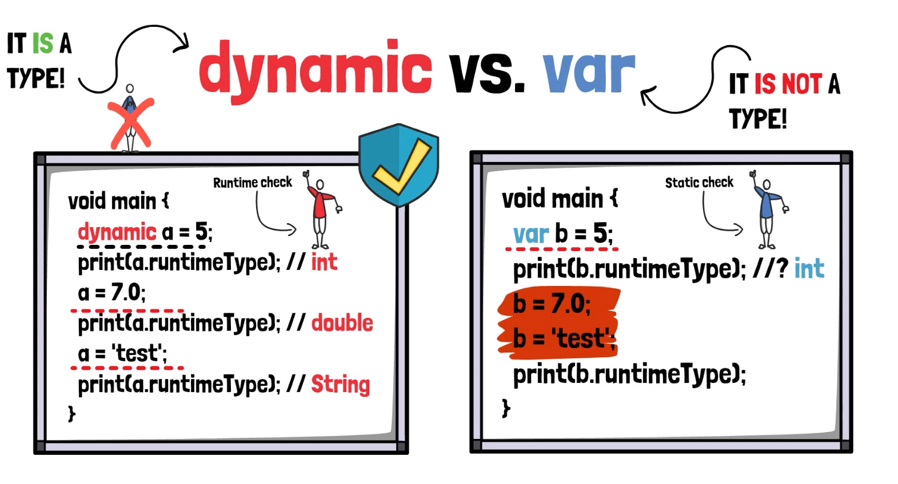
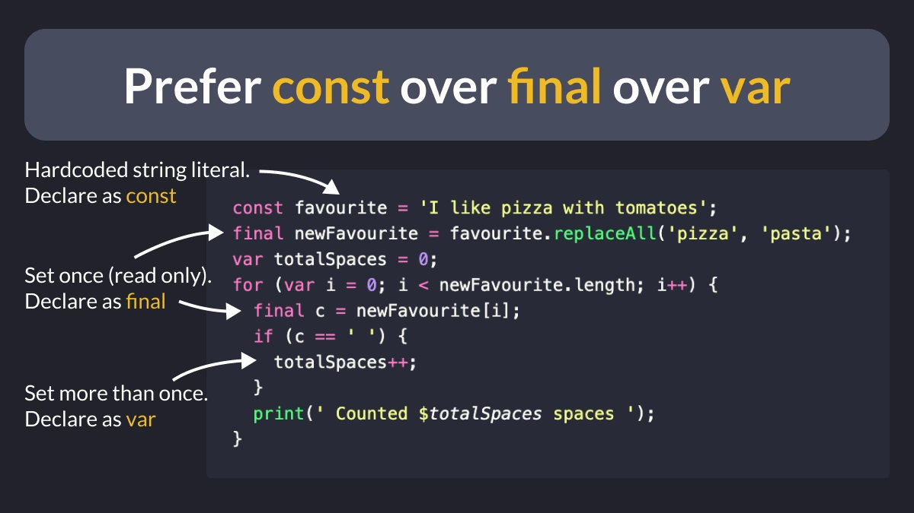
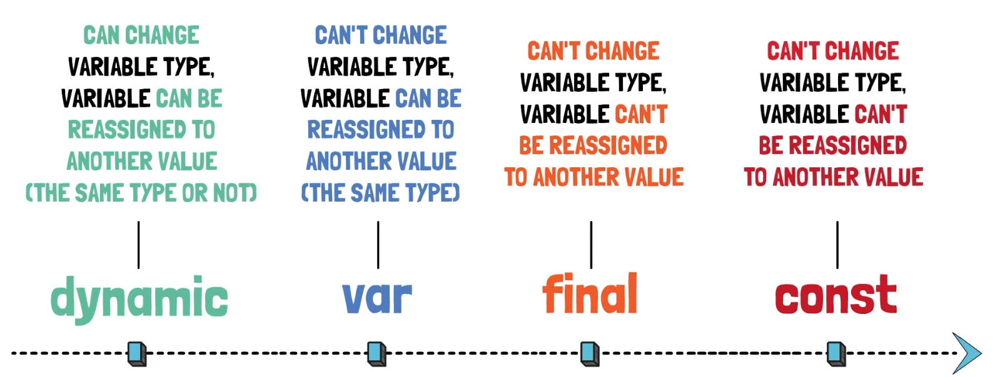

# Dart Data Types: Detailed Overview with Examples

Dart is a statically typed language, meaning every variable must be declared with a type. Below are the primary data types in Dart, along with examples for each.



## 1. Numbers

### a. int

Represents integer values.

```dart
int age = 25;
int hexValue = 0xDEADBEEF;
```

> [!NOTE]  
> `int hexValue = 0xDEADBEEF;` is a hexadecimal number.

### b. double

Represents floating point numbers.

```dart
double height = 5.9;
double exponent = 1.42e5; // Scientific notation
```

## 2. Strings

A sequence of characters enclosed in single or double quotes.

```dart
String name = 'John Doe';
String greeting = "Hello, World!";
String multiline = '''
This is a
multiline string.
''';
```

- String Interpolation:

Combining variables with strings.

```dart
String message = 'Hello, $name';
int sum = 2 + 3;
String sumMessage = 'The sum of 2 and 3 is $sum'; // output: The sum of 2 and 3 is 5
String complexMessage = 'The sum of 2 and 3 is ${2 + 3}'; // output: The sum of 2 and 3 is 5
```

## 3. Booleans

Represents `true` or `false`.

```dart
bool isTrue = true;
bool isFalse = false;
```

## 4. Lists (Arrays)

Represents an ordered collection of values.

### a. Fixed-length list

```dart
List<int> numbers = List<int>.filled(5, 0); // List of 5 integers initialized to 0
```

### b. Growable list

```dart
List<String> fruits = ['Apple', 'Banana', 'Cherry'];
fruits.add('Watermelon');
print(fruits); // Output: ['Apple', 'Banana', 'Cherry', 'Watermelon']
```

## 5. Maps

Represents a collection of key-value pairs.

```dart
Map<String, String> capitals = {
  'USA': 'Washington, D.C.',
  'France': 'Paris',
  'Japan': 'Tokyo'
};
print(capitals); // Output: {'USA': 'Washington, D.C.', 'France': 'Paris', 'Japan': 'Tokyo'}
capitals['India'] = 'New Delhi';
print(capitals); // Output: {'USA': 'Washington, D.C.', 'France': 'Paris', 'Japan': 'Tokyo', 'India': 'New Delhi'}
```

another example

```dart
Map<String, dynamic> user = {
  'name': 'John Doe',
  'age': 25,
  'height': 5.9,
};

print(user['name']); // Output: John Doe
print(user['age']); // Output: 25
print(user['height']); // Output: 5.9

user['age'] = 26;
print("New age: ${user['age']}"); // Output: mew age: 26

user['city'] = 'New York';
print(user); // Output: {'name': 'John Wick', 'age': 26, 'height': 5.9, 'gender': 'male', 'city': 'New York'}
```

## 6. Sets

Represents a collection of unique values as key value pairs.

```dart
Set<int> uniqueNumbers = {1, 2, 3, 4};
uniqueNumbers.add(5);
print(uniqueNumbers); // Output: {1, 2, 3, 4, 5}
uniqueNumbers.add(3); // Duplicate, won't be added
print(uniqueNumbers); // Output: {1, 2, 3, 4, 5}
```

## 7. Dynamic

A special type that indicates the variable can hold values of any type.

```dart
dynamic variable = 42;
print(variable); // Output: 42
variable = 'Hello'; // No error, type is dynamic
print(variable); // Output: Hello
variable = true;    // Still no error
print(variable); // Output: true
```

<details>

<summary>Dynamic examples with images</summary>

### 1



### 2



### 3



</details>

## 8. Var

Used to declare a variable without specifying its type. The type will be inferred from the value.

```dart
var name = 'John Doe'; // string name = 'John Doe';
var age = 25; // int age = 25;
var height = 5.9; // double height = 5.9;
var isMale = true; // bool isMale = true;

name = 20; // Error: A value of type 'int' can't be assigned to a variable of type 'String'.
```

<details>

<summary>Var examples with images</summary>



</details>

> [!IMPORTANT]
> difference between `var` and `dynamic`:  
> `dynamic` is a type underlying all Dart objects. You shouldn't need to explicitly use it in most cases.
>
> `var` is a keyword, meaning "I don't care to notate what the type is here." Dart will replace the var keyword with the initializer type, or leave it dynamic by default if there is no initializer.
>
> Use var if you expect a variable assignment to change during its lifetime:
>
> ```dart
> var msg = "Hello world.";
> msg = "Hello world again.";
> ```
>
> 

## 9. Difference between final, const and var keywords



```dart
void main() {
  // compile-time constant
  const favourite = 'I like pizza with tomatoes';
  // read-only variable, set just once
  final newFavourite = favourite.replaceAll('pizza', 'pasta');
  // read/write variable, set more than once
  var totalSpaces = 0;
  for (var i = 0; i < newFavourite.length; i++) {
    final c = newFavourite[i];
    if (c == ' ') {
      totalSpaces++;
    }
    print('Counted $totalSpaces spaces');
  }
}
```

### dynamic - var - final - const



## 10. Sound Null safety
